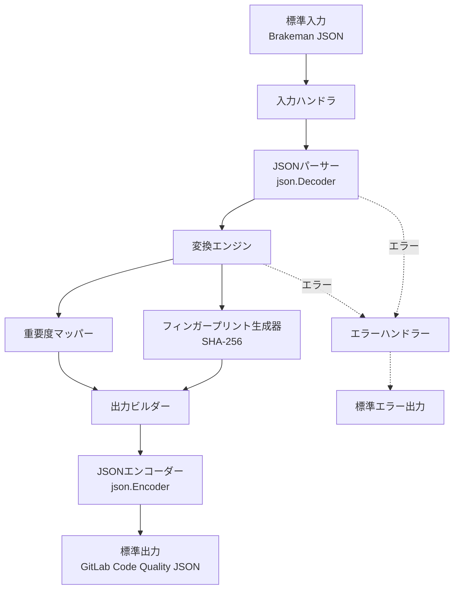
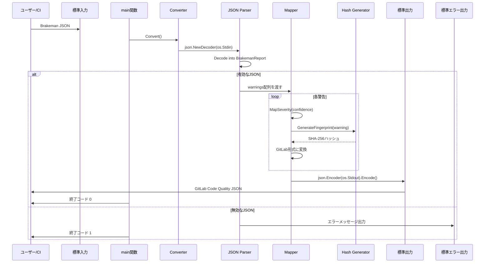
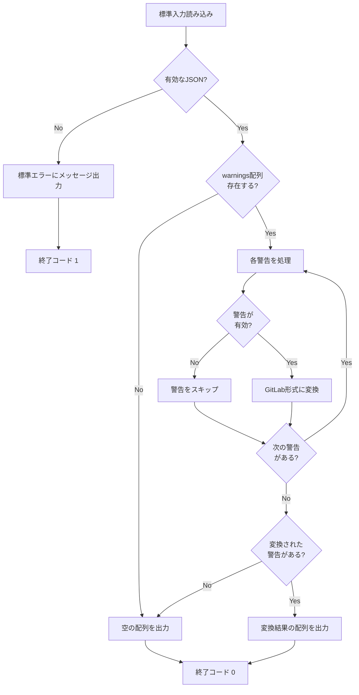
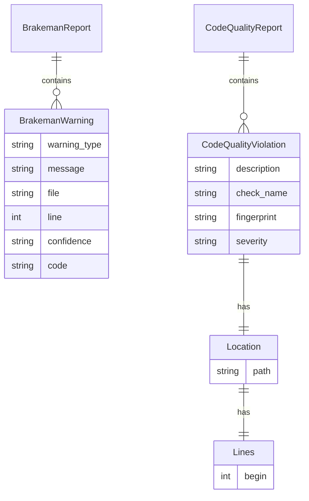

# 技術設計書

## 概要

本ツールは、RubyセキュリティスキャナーBrakemanが出力するJSON形式のレポートを、GitLab Code Quality形式のJSONに変換するコマンドラインツールです。標準入力からBrakemanのJSON出力を受け取り、変換したJSONを標準出力に出力します。CI/CDパイプラインでの統合を想定し、パイプ経由でのデータ処理を実現します。

**Purpose**: Brakemanのセキュリティスキャン結果をGitLab UIで可視化可能にすることで、開発チームがセキュリティ問題を迅速に特定し対処できるようにする。

**Users**: CI/CDパイプラインでBrakemanを実行し、結果をGitLabで確認したい開発者およびセキュリティエンジニア。

**Impact**: Brakemanの警告をGitLab Code Qualityレポートとして統合することで、既存のGitLabワークフローに組み込み可能になる。

### ゴール

- BrakemanのJSON出力をGitLab Code Quality形式に正確に変換する
- 標準入力/出力を使用したパイプフレンドリーな設計
- 無効なデータを適切にハンドリングし、部分的な変換結果を提供する
- テスト可能で保守しやすいコード構造

### 非ゴール

- Brakeman本体の実行機能（別ツールとして提供される）
- GitLab APIへの直接アップロード（GitLab CIが処理）
- 複雑なCLI機能（サブコマンド、設定ファイル、対話的UI）
- Brakeman以外のセキュリティツールのサポート（将来的な拡張として検討可能）

## アーキテクチャ

### アーキテクチャパターンと境界マップ



**Architecture Integration**:

- **選択パターン**: パイプライン処理パターン（Pipeline Processing Pattern）
    - 標準入力→パース→変換→出力の一方向データフロー
    - 各ステージが明確な責務を持ち、独立してテスト可能
- **ドメイン/機能境界**:
    - 入力層：標準入力からのJSON読み込みとバリデーション
    - 変換層：Brakeman形式からGitLab形式へのマッピング
    - 出力層：JSON整形と標準出力への書き込み
    - エラー処理：各層のエラーを標準エラー出力に集約
- **新規コンポーネントの根拠**:
    - **重要度マッパー**: Brakemanの信頼度レベル（High/Medium/Weak）をGitLabの重要度（critical/major/minor/info）に変換する専用ロジックが必要（要件4）
    - **フィンガープリント生成器**: 一意のハッシュ生成に特化したコンポーネント。SHA-256を使用し、ファイルパス・行番号・警告タイプ・メッセージから計算（要件5）

### テクノロジースタック

| Layer    | Choice / Version          | Role in Feature                                | Notes                                                      |
| -------- | ------------------------- | ---------------------------------------------- | ---------------------------------------------------------- |
| CLI      | Go 1.21+ 標準ライブラリ   | コマンドライン実行環境、JSON処理、ハッシュ計算 | CobraやViperは不要。標準ライブラリで十分な機能を提供       |
| JSON処理 | encoding/json             | BrakemanとGitLab形式のパース・シリアライズ     | `json.Decoder`でストリーミング処理を実現                   |
| ハッシュ | crypto/sha256             | フィンガープリント生成                         | SHA-256は暗号学的に安全で業界標準。詳細は`research.md`参照 |
| テスト   | testing + testify/require | ユニットテストとテーブル駆動テスト             | testifyのrequireパッケージで失敗時即停止                   |

## システムフロー

### メインデータフロー



**フロー上の重要な決定事項**:

- ストリーミング処理により、大容量JSONでもメモリ効率を維持
- 無効な警告は個別にスキップし、処理を継続（要件7.3）
- 空の警告リストは空の配列として出力（要件2.4）

### エラー処理フロー



## 要件トレーサビリティ

| Requirement             | Summary                                | Components                 | Interfaces            | Flows              |
| ----------------------- | -------------------------------------- | -------------------------- | --------------------- | ------------------ |
| 1.1, 1.2                | 標準入力からのJSON読み込み             | InputHandler, Parser       | Convert()             | メインデータフロー |
| 1.3, 1.4                | 入力エラーハンドリング                 | ErrorHandler               | Convert()             | エラー処理フロー   |
| 2.1, 2.2                | Brakeman警告の抽出                     | Parser                     | BrakemanReport構造体  | メインデータフロー |
| 2.3                     | codeフィールドのフィンガープリント含有 | FingerprintGen             | GenerateFingerprint() | メインデータフロー |
| 2.4                     | 空の警告リスト処理                     | Parser, OutputBuilder      | Convert()             | エラー処理フロー   |
| 3.1, 3.2, 3.3           | GitLab形式への変換                     | Transformer, OutputBuilder | ConvertWarning()      | メインデータフロー |
| 3.4, 3.5, 3.6, 3.7, 3.8 | フィールドマッピング                   | Transformer                | ConvertWarning()      | メインデータフロー |
| 4.1, 4.2, 4.3, 4.4, 4.5 | 重要度マッピング                       | SeverityMapper             | MapSeverity()         | メインデータフロー |
| 5.1, 5.2, 5.3, 5.4      | フィンガープリント生成                 | FingerprintGen             | GenerateFingerprint() | メインデータフロー |
| 6.1, 6.2, 6.3, 6.4      | 標準出力への出力                       | OutputBuilder, Encoder     | Convert()             | メインデータフロー |
| 7.1, 7.2, 7.3, 7.4      | エラーハンドリング                     | ErrorHandler               | Convert()             | エラー処理フロー   |

## コンポーネントとインターフェース

### コンポーネント概要

| Component      | Domain/Layer | Intent                                          | Req Coverage                           | Key Dependencies (P0/P1)                 | Contracts |
| -------------- | ------------ | ----------------------------------------------- | -------------------------------------- | ---------------------------------------- | --------- |
| InputHandler   | 入力層       | 標準入力からJSONを読み込み、初期バリデーション  | 1.1, 1.2, 1.3, 1.4                     | json.Decoder (P0)                        | Service   |
| Parser         | 入力層       | BrakemanのJSON構造をGo構造体にパース            | 2.1, 2.2, 2.4                          | BrakemanReport型 (P0)                    | Service   |
| Transformer    | 変換層       | BrakemanWarningをCodeQualityViolationに変換     | 3.1, 3.2, 3.3, 3.4, 3.5, 3.6, 3.7, 3.8 | SeverityMapper (P0), FingerprintGen (P0) | Service   |
| SeverityMapper | 変換層       | Brakemanの信頼度をGitLabの重要度にマッピング    | 4.1, 4.2, 4.3, 4.4, 4.5                | なし                                     | Service   |
| FingerprintGen | 変換層       | SHA-256ハッシュによる一意フィンガープリント生成 | 5.1, 5.2, 5.3, 5.4                     | crypto/sha256 (P0)                       | Service   |
| OutputBuilder  | 出力層       | GitLab形式のJSON配列を構築                      | 6.1, 6.2, 6.3, 6.4                     | json.Encoder (P0)                        | Service   |
| ErrorHandler   | エラー処理層 | エラーメッセージの整形と標準エラー出力          | 7.1, 7.2, 7.3, 7.4                     | os.Stderr (P0)                           | Service   |

### 入力層

#### InputHandler & Parser

| Field        | Detail                                                  |
| ------------ | ------------------------------------------------------- |
| Intent       | 標準入力からBrakeman JSONを読み込み、構造体にパースする |
| Requirements | 1.1, 1.2, 1.3, 1.4, 2.1, 2.2, 2.4                       |

**Responsibilities & Constraints**

- 標準入力からのJSONストリーミング読み込み
- 空入力および無効なJSONの検出とエラー報告
- Brakeman JSON構造の型安全なパース

**Dependencies**

- Inbound: なし（標準入力のみ）
- Outbound: Transformer — パース済み警告の配列を渡す (P0)
- External: encoding/json — JSONデコード (P0)

**Contracts**: Service [x] / API [ ] / Event [ ] / Batch [ ] / State [ ]

##### Service Interface

```go
// BrakemanReport represents the structure of Brakeman JSON output
type BrakemanReport struct {
    Warnings []BrakemanWarning `json:"warnings"`
}

// BrakemanWarning represents a single security warning from Brakeman
type BrakemanWarning struct {
    WarningType string `json:"warning_type"`
    Message     string `json:"message"`
    File        string `json:"file"`
    Line        int    `json:"line"`
    Confidence  string `json:"confidence"`
    Code        string `json:"code,omitempty"` // Optional field
}

// ParseBrakemanJSON reads from stdin and parses Brakeman JSON
func ParseBrakemanJSON(input io.Reader) (*BrakemanReport, error)
```

- Preconditions: inputは有効なio.Reader
- Postconditions: 成功時は非nilのBrakemanReport、失敗時はエラー
- Invariants: warningsフィールドが存在しない場合は空のスライスとして扱う

**Implementation Notes**

- Integration: `json.NewDecoder(os.Stdin)`を使用してストリーミング処理
- Validation: JSON構造のバリデーションは`json.Decoder`に委譲。空入力はエラーとして扱う
- Risks: Brakemanが新しいフィールドを追加しても、未知フィールドは自動的に無視される

### 変換層

#### Transformer

| Field        | Detail                                               |
| ------------ | ---------------------------------------------------- |
| Intent       | BrakemanWarningをGitLab Code Quality Violationに変換 |
| Requirements | 3.1, 3.2, 3.3, 3.4, 3.5, 3.6, 3.7, 3.8               |

**Responsibilities & Constraints**

- フィールドマッピングの実行
- ファイルパスの正規化（"./"プレフィックスの除去）
- 無効な警告のスキップと処理継続

**Dependencies**

- Inbound: Parser — BrakemanWarningのスライス (P0)
- Outbound: SeverityMapper — 重要度変換 (P0), FingerprintGen — フィンガープリント生成 (P0)
- External: なし

**Contracts**: Service [x] / API [ ] / Event [ ] / Batch [ ] / State [ ]

##### Service Interface

```go
// CodeQualityViolation represents a GitLab Code Quality violation
type CodeQualityViolation struct {
    Description string   `json:"description"`
    CheckName   string   `json:"check_name"`
    Fingerprint string   `json:"fingerprint"`
    Severity    string   `json:"severity"`
    Location    Location `json:"location"`
}

type Location struct {
    Path  string `json:"path"`
    Lines Lines  `json:"lines"`
}

type Lines struct {
    Begin int `json:"begin"`
}

// ConvertWarnings converts Brakeman warnings to GitLab violations
func ConvertWarnings(warnings []BrakemanWarning) []CodeQualityViolation
```

- Preconditions: warningsは空でもよい
- Postconditions: 有効な警告のみを変換し、空配列または変換結果を返す
- Invariants: 無効な警告は結果に含めない

**Implementation Notes**

- Integration: SeverityMapperとFingerprintGenを組み合わせて各警告を変換
- Validation: 必須フィールド（file, line, warning_type, message）が欠けている警告はスキップ
- Risks: ファイルパス正規化でエッジケース（例：Windows形式のパス）が発生する可能性

#### SeverityMapper

| Field        | Detail                                             |
| ------------ | -------------------------------------------------- |
| Intent       | Brakemanの信頼度レベルをGitLabの重要度にマッピング |
| Requirements | 4.1, 4.2, 4.3, 4.4, 4.5                            |

**Responsibilities & Constraints**

- 信頼度文字列の正規化（大文字小文字の統一）
- 未知の信頼度レベルへのデフォルト値適用

**Dependencies**

- Inbound: Transformer — 信頼度文字列 (P0)
- Outbound: なし
- External: なし

**Contracts**: Service [x] / API [ ] / Event [ ] / Batch [ ] / State [ ]

##### Service Interface

```go
// MapSeverity maps Brakeman confidence to GitLab severity
func MapSeverity(confidence string) string
```

- Preconditions: confidenceは任意の文字列（空文字列を含む）
- Postconditions: "critical", "major", "minor", "info"のいずれかを返す
- Invariants: 未知の値は常に"info"にマッピング

**Mapping Rules**:

- "High" → "critical"
- "Medium" → "major"
- "Weak" または "Low" → "minor"
- その他 → "info"

**Implementation Notes**

- Integration: 大文字小文字を無視した比較（`strings.ToLower()`使用）
- Validation: すべての入力値を受け入れ、デフォルト値を返す
- Risks: Brakemanが新しい信頼度レベルを追加した場合、一時的に"info"として扱われる

#### FingerprintGen

| Field        | Detail                                            |
| ------------ | ------------------------------------------------- |
| Intent       | SHA-256ハッシュによる一意のフィンガープリント生成 |
| Requirements | 5.1, 5.2, 5.3, 5.4                                |

**Responsibilities & Constraints**

- ファイルパス、行番号、警告タイプ、メッセージの組み合わせからハッシュを生成
- codeフィールドが存在する場合は含める
- 一貫性のある16進数文字列形式で出力

**Dependencies**

- Inbound: Transformer — BrakemanWarning (P0)
- Outbound: なし
- External: crypto/sha256 — SHA-256ハッシュ計算 (P0)

**Contracts**: Service [x] / API [ ] / Event [ ] / Batch [ ] / State [ ]

##### Service Interface

```go
// GenerateFingerprint creates a unique SHA-256 hash for a warning
func GenerateFingerprint(warning BrakemanWarning) string
```

- Preconditions: warningは有効なBrakemanWarning（必須フィールド存在）
- Postconditions: 64文字の16進数文字列を返す
- Invariants: 同一の入力値に対して常に同一のハッシュを生成

**Hash Input Format**:

```text
<file>:<line>:<warning_type>:<message>[:<code>]
```

**Implementation Notes**

- Integration: `crypto/sha256.New()`でハッシャーを作成し、`hex.EncodeToString()`で16進数化
- Validation: 入力フィールドが空の場合でもハッシュを生成（空文字列として扱う）
- Risks: なし（決定論的処理）

### 出力層

#### OutputBuilder

| Field        | Detail                                           |
| ------------ | ------------------------------------------------ |
| Intent       | GitLab Code Quality JSON配列を標準出力に書き込み |
| Requirements | 6.1, 6.2, 6.3, 6.4                               |

**Responsibilities & Constraints**

- JSON配列のシリアライズ
- BOMなしUTF-8出力の保証
- 標準出力への書き込み

**Dependencies**

- Inbound: Transformer — CodeQualityViolationのスライス (P0)
- Outbound: なし（標準出力のみ）
- External: encoding/json — JSONエンコード (P0)

**Contracts**: Service [x] / API [ ] / Event [ ] / Batch [ ] / State [ ]

##### Service Interface

```go
// WriteCodeQualityJSON writes violations to output as JSON array
func WriteCodeQualityJSON(violations []CodeQualityViolation, output io.Writer) error
```

- Preconditions: outputは有効なio.Writer、violationsは空でもよい
- Postconditions: 成功時はJSON配列を出力、失敗時はエラー
- Invariants: 常にルートレベルでJSON配列を出力

**Implementation Notes**

- Integration: `json.NewEncoder(os.Stdout)`を使用
- Validation: `json.Encoder`が自動的にBOMなしUTF-8で出力
- Risks: なし（標準ライブラリが保証）

### エラー処理層

#### ErrorHandler

| Field        | Detail                                 |
| ------------ | -------------------------------------- |
| Intent       | エラーメッセージの整形と標準エラー出力 |
| Requirements | 7.1, 7.2, 7.3, 7.4                     |

**Responsibilities & Constraints**

- 人間が読みやすいエラーメッセージの生成
- 標準エラー出力への書き込み
- 適切な終了コードの設定

**Dependencies**

- Inbound: 全コンポーネント — エラー (P0)
- Outbound: なし（標準エラー出力のみ）
- External: os.Stderr (P0)

**Contracts**: Service [x] / API [ ] / Event [ ] / Batch [ ] / State [ ]

##### Service Interface

```go
// HandleError writes error message to stderr and returns exit code
func HandleError(err error) int
```

- Preconditions: errは非nil
- Postconditions: エラーメッセージを標準エラーに出力し、終了コードを返す
- Invariants: 非nilエラーに対して常に非ゼロの終了コードを返す

**Exit Codes**:

- 0: 成功（空の配列出力を含む）
- 1: エラー（無効なJSON、読み込み失敗など）

**Implementation Notes**

- Integration: `fmt.Fprintf(os.Stderr, ...)`で出力
- Validation: エラーメッセージにコンテキスト情報を含める
- Risks: なし

## データモデル

### ドメインモデル

本ツールは2つの主要なドメインエンティティを扱います：

1. **BrakemanWarning** (入力ドメイン)
    - Brakemanが検出したセキュリティ警告を表現
    - 警告タイプ、メッセージ、ファイル位置、信頼度を含む
    - オプショナルなcodeフィールドでコンテキストを提供

2. **CodeQualityViolation** (出力ドメイン)
    - GitLab Code Quality形式の違反情報を表現
    - 説明、チェック名、フィンガープリント、重要度、位置情報を含む
    - GitLabの仕様に準拠した構造

**ドメインルール**:

- 1つのBrakemanWarningは1つのCodeQualityViolationにマッピング
- 信頼度レベルは重要度に変換される際、決定論的なルールに従う
- フィンガープリントは警告の一意性を保証

### 論理データモデル

**構造定義**:



**関係性とカーディナリティ**:

- BrakemanReport : BrakemanWarning = 1 : 0..N
- CodeQualityReport : CodeQualityViolation = 1 : 0..N
- CodeQualityViolation : Location = 1 : 1
- Location : Lines = 1 : 1

**属性と型**:

- すべての文字列フィールドはUTF-8エンコーディング
- line/beginはゼロまたは正の整数
- codeフィールドはオプショナル（`omitempty`タグ）

**整合性ルール**:

- 必須フィールド（warning_type, message, file, line, confidence）が欠けている警告はスキップ
- 出力は常にJSON配列であり、単一オブジェクトは許可しない

## エラーハンドリング

### エラー戦略

Goの慣用的な明示的エラーハンドリングパターンを採用します。各関数は`error`を返し、呼び出し側が適切に処理します。

### エラーカテゴリと応答

**入力エラー**: 無効なJSON、空入力 → 標準エラーに詳細メッセージ出力、終了コード1

**データエラー**: 無効な警告（必須フィールド欠落） → 警告をスキップし処理継続、ログ出力なし

**システムエラー**: 標準入出力の読み書き失敗 → 標準エラーにエラーメッセージ出力、終了コード1

**処理エラー**: すべての警告が無効 → 空のJSON配列を出力、終了コード0（要件7.4）

### モニタリング

- 標準エラー出力へのメッセージ出力（CI/CDログに記録される）
- 終了コードによる成功/失敗の明確な区別
- 詳細なエラーメッセージによる問題の迅速な特定

## テスト戦略

### ユニットテスト

- **MapSeverity関数**: 全信頼度レベルのマッピング検証、大文字小文字の区別なし検証、未知値のデフォルト処理
- **GenerateFingerprint関数**: 同一入力で一貫したハッシュ生成、codeフィールドありなしの検証、空フィールドの処理
- **ConvertWarnings関数**: 有効な警告の正しい変換、無効な警告のスキップ、空配列入力の処理
- **ParseBrakemanJSON関数**: 有効なJSON構造のパース、無効なJSONのエラー検出、空入力の処理
- **WriteCodeQualityJSON関数**: 正しいJSON配列形式の出力、空配列の出力、BOMなし出力の検証

### 統合テスト

- **エンドツーエンド変換**: 完全なBrakeman JSONからGitLab形式への変換フロー
- **パイプライン統合**: 実際のBrakemanコマンド出力を使用したパイプテスト
- **エラーシナリオ**: 無効なJSON、部分的に無効な警告、空入力の処理
- **大容量データ**: 数百の警告を含むJSONのメモリ効率検証

### テーブル駆動テストパターン

すべてのユニットテストは以下のパターンを使用：

```go
func TestMapSeverity(t *testing.T) {
    tests := []struct {
        name       string
        confidence string
        want       string
    }{
        {"High confidence", "High", "critical"},
        {"Medium confidence", "Medium", "major"},
        {"Weak confidence", "Weak", "minor"},
        {"Unknown confidence", "Unknown", "info"},
    }

    for _, tt := range tests {
        t.Run(tt.name, func(t *testing.T) {
            got := MapSeverity(tt.confidence)
            require.Equal(t, tt.want, got)
        })
    }
}
```

## セキュリティ考慮事項

### データ保護

- セキュリティツールの出力を扱うため、フィンガープリントには暗号学的に安全なSHA-256を使用
- 入力データの検証によるインジェクション攻撃の防止（JSONパーサーが処理）
- 標準入出力のみを使用し、ファイルシステムやネットワークアクセスなし

### セキュアなハッシュ生成

- MD5やSHA-1などの脆弱なアルゴリズムは使用しない
- `crypto/sha256`パッケージは暗号学的に安全で、ハードウェアアクセラレーション対応

## パフォーマンスとスケーラビリティ

### 目標メトリクス

- **処理速度**: 1000警告/秒以上
- **メモリ使用量**: 50MB未満（10000警告の場合）
- **起動時間**: 100ms未満

### スケーリングアプローチ

- ストリーミング処理（`json.Decoder`）により、警告数に対してメモリ使用量が線形増加
- 大規模プロジェクトでも、通常数千の警告を想定し、十分な性能を提供

### 最適化技術

- 構造体による型安全な処理でリフレクションのオーバーヘッドを回避
- SHA-256のハードウェアアクセラレーション（SHA-NI）を自動利用
- 不要な文字列コピーを避けるための効率的なバッファ管理
